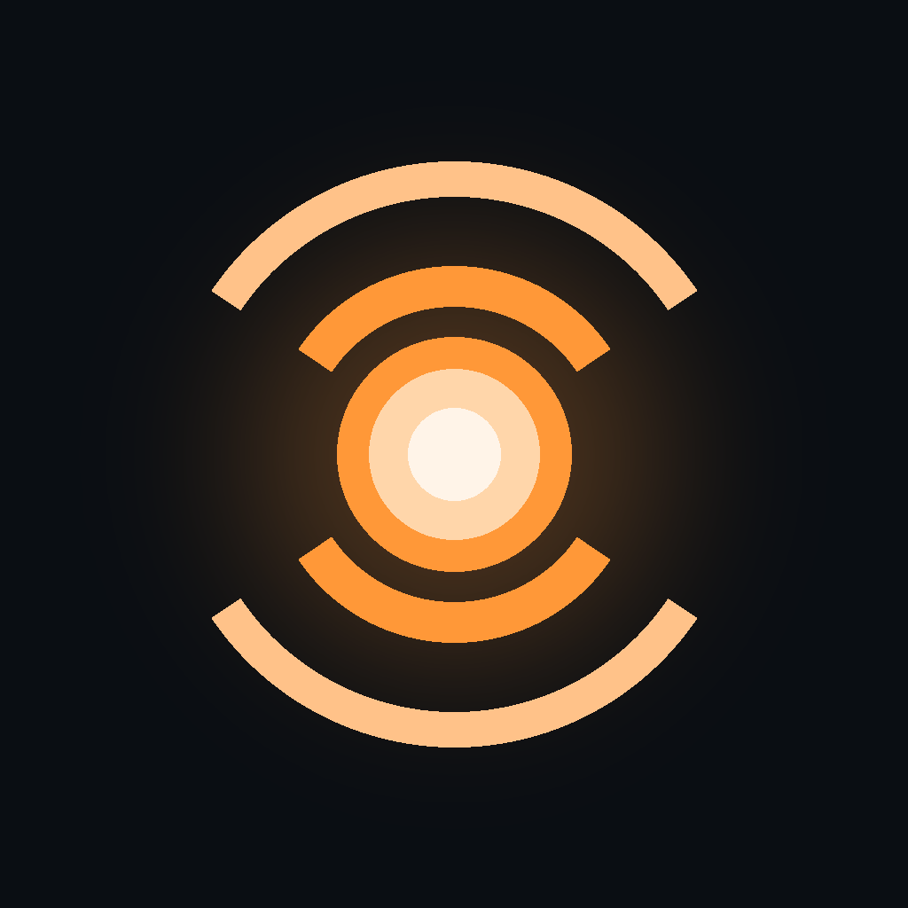
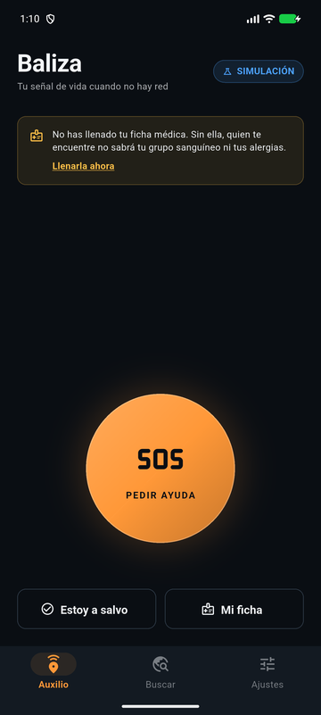
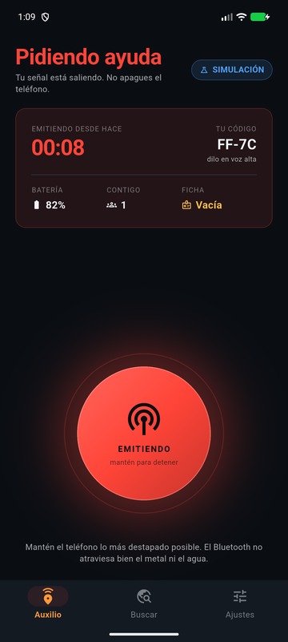
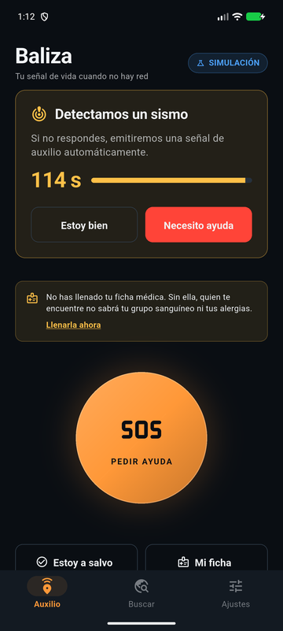
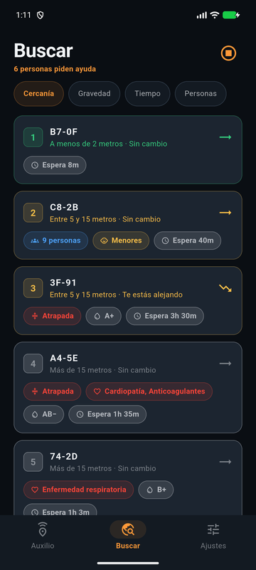
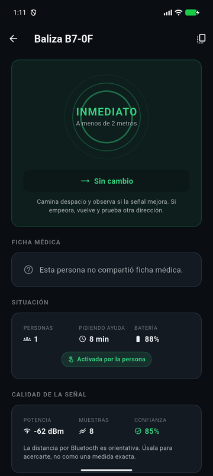
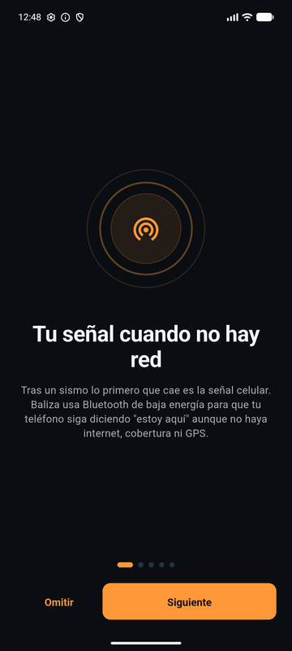

<div align="center">



# Baliza

**Tu señal de vida cuando no hay red.**

Señalización de auxilio y localización de personas atrapadas tras un sismo,
mediante Bluetooth de baja energía. Sin internet, sin cobertura celular y sin GPS.

[](https://flutter.dev)
[](https://dart.dev)
[](#)
[](#)
[](LICENSE)

</div>

---

## La app

<div align="center">

| Pedir ayuda | Emitiendo | Detección de sismo |
|:---:|:---:|:---:|
|  |  |  |
| Un toque y empiezas a emitir. Detener exige mantener pulsado. | El rojo aparece **sólo** aquí. Cronómetro, código y batería. | Dos minutos para responder. El silencio se lee como emergencia. |

| Buscar personas | Detalle | Bienvenida |
|:---:|:---:|:---:|
|  |  |  |
| Ordenadas por prioridad, con tendencia de acercamiento. | Ficha médica, situación y confianza de la medición. | Se explica cada permiso antes de pedirlo. |

</div>

> Capturas tomadas en emulador Android con el **modo simulación** activo.

---

## El problema

El **10 de agosto de 2026**, un sismo de magnitud **7,4** con epicentro cerca de
San José del Palmar (Chocó) se sintió en todo el territorio colombiano. Dejó al
menos **132 muertos**, 570 heridos y 61 edificios colapsados, con 96 réplicas
posteriores.

No fue el primero. El **25 de enero de 1999**, un sismo de magnitud 6,2 con
epicentro en Córdoba, **Quindío**, mató a **1.185 personas** —971 sólo en
Armenia— e inhabilitó 35.972 viviendas.

En ambos casos se repitió el mismo patrón: **las comunicaciones colapsaron**. La
red celular cae por daño físico, por corte eléctrico o, simplemente, por
saturación cuando toda una ciudad marca a la vez. Y sin comunicaciones, la
búsqueda de personas atrapadas bajo escombros se hace a mano, a oído y a gritos.

Mientras tanto, en el bolsillo de casi toda esa gente hay un radio que sigue
funcionando: el **Bluetooth de baja energía**. No necesita antenas, ni
operadores, ni electricidad de la red. Sólo la batería del teléfono.

**Baliza convierte ese radio en una señal de vida.**

---

## Qué hace

<table>
<tr>
<td width="50%" valign="top">

### 🆘 Modo auxilio

Un toque y el teléfono empieza a decir *"estoy aquí"*:

- **Emite** una baliza por Bluetooth con tu situación y tu ficha médica
- **Suena** una sirena de barrido ascendente, audible aunque el teléfono esté en silencio
- **Vibra** y **destella la linterna** con el patrón SOS en morse

Apagarlo exige mantener pulsado dos segundos: un roce accidental no puede
cortar tu única señal.

</td>
<td width="50%" valign="top">

### 🔦 Modo rescate

Si estás a salvo y quieres ayudar:

- **Escucha** todas las balizas en un radio de 10 a 30 metros
- **Ordena** a quién atender primero por cercanía, gravedad, tiempo de espera o número de personas
- **Guía** con una lectura de *"te estás acercando / te estás alejando"* mientras caminas
- **Muestra** el grupo sanguíneo y las alergias antes de llegar

</td>
</tr>
<tr>
<td colspan="2">

### 🌐 Detección automática de sismos

Si la activas, Baliza vigila el acelerómetro, el giroscopio y el barómetro. Al
reconocer un evento sísmico te pregunta **«¿estás bien?»** con dos botones en la
pantalla de bloqueo.

Si respondes *«Estoy bien»*, no pasa nada. Si respondes *«Necesito ayuda»*, emite
al instante. Y si **no respondes en dos minutos**, emite igual — porque quien
queda inconsciente o atrapado no puede contestar, y ése es exactamente el caso
que justifica que la app exista.

</td>
</tr>
</table>

---

## Lo que Baliza **no** es

Ser honesto sobre los límites es parte del diseño de una herramienta de
emergencia:

- **No sustituye a la línea 123.** Si tienes cobertura, llama.
- **No es un localizador GPS.** No sabe dónde estás ni lo quiere saber. Sólo dice
  *"hay alguien a unos metros en esta dirección"*.
- **No mide distancias con precisión.** El Bluetooth es demasiado ruidoso para eso.
  Por eso la app muestra bandas anchas —*Inmediato, Cerca, Media, Lejos*— y no
  cifras con decimales que invitarían a confiar de más.
- **No atraviesa cualquier cosa.** El metal y el agua bloquean 2,4 GHz. Bajo una
  losa gruesa el alcance cae mucho.
- **No es un protocolo de triaje clínico.** El orden que propone resuelve una
  pregunta anterior y más modesta: con ocho señales en pantalla y un solo equipo,
  ¿por cuál empezar? La decisión siempre es del rescatista.

---

## Cómo funciona

### El protocolo: 16 bytes que pueden salvar una vida

Un anuncio BLE tiene **31 bytes en total**. Descontando cabeceras, quedan unos 20
útiles. Baliza fija su mensaje en **16 bytes**:

```
Offset  Tam  Campo
0       1    versión (4 bits) | tipo de mensaje (4 bits)
1       1    indicadores: manual, automático, atrapado, movilidad reducida…
2       4    identificador seudónimo (uint32)
6       1    batería 0–100
7       1    minutos emitiendo
8       1    grupo sanguíneo (4 bits) | franja etaria (4 bits)
9       1    condiciones médicas (máscara de bits)
10      1    alergias (máscara de bits)
11      1    personas en el punto
12      2    reservado
14      2    CRC-16/CCITT-FALSE
```

Esa restricción explica todo el diseño: **no hay nombres, ni documento, ni texto
libre**. Sólo catálogos cerrados y máscaras de bits. El efecto secundario es
deseable — una baliza interceptada permite **atender** a la persona, pero no
**identificarla**.

### Privacidad: rotar, salvo cuando importa la continuidad

Un identificador fijo convertiría la app en un rastreador. Uno siempre cambiante
rompería el rescate, porque el equipo perdería la pista de la señal justo
mientras se acerca.

La regla: **el identificador rota cada 15 minutos en reposo, y se congela
mientras hay una emergencia activa.** Al terminar, se fuerza uno nuevo, para que
la baliza usada durante la emergencia no siga siendo rastreable después.

### Distancia: honestidad sobre precisión

La estimación usa el modelo log-distancia de pérdida de trayecto:

```
d = 10 ^ ((P₁ₘ − RSSI) / (10 · n))
```

…con un exponente `n` ajustable según el medio (campo abierto 2,0 · interior 2,8
· **escombros 3,5**), media recortada para absorber lecturas atípicas, y un
indicador de confianza que **se le muestra al rescatista**. Un rescatista que
sabe que la medición es débil confía menos en ella y busca con más criterio
propio. Ocultar la incertidumbre sería más bonito y mucho más peligroso.

### Detección: dos testigos no bastan, tres sí

Un golpe accidental no puede disparar una alerta. Baliza exige que **sensores
distintos** corroboren la anomalía dentro de una misma ventana temporal:

| Barómetro | Sensores requeridos | Ventana |
|---|---|---|
| Disponible | 3 (acelerómetro + giroscopio + barómetro) | 1.200 ms |
| Ausente | 2 (acelerómetro + giroscopio) | **400 ms** |

Al perder el tercer testigo se compensa exigiendo **mayor simultaneidad**. Y las
anomalías **caducan**: una lectura vieja nunca se suma a otra nueva como si
fueran simultáneas.

---

## Arquitectura

Arquitectura hexagonal. La regla es una sola: **el dominio no sabe que existe el
Bluetooth**.

```
lib/
├── domain/           ← Dart puro. Cero dependencias de Flutter o de plataforma.
│   ├── entities/         SosSignal · MedicalProfile · Survivor · SurvivorRegistry
│   ├── value_objects/    Catálogos codificados del protocolo
│   ├── services/         SosPayloadCodec · DisasterDetector · DistanceEstimator
│   │                     BeaconIdentity · TriageRanker
│   └── ports/            Interfaces: BeaconTransmitter · BeaconScanner
│                         SensorSource · SirenPlayer · Clock · …
│
├── application/      ← Casos de uso y estado observable
│   ├── SosController · RescueController · DetectionController
│   ├── AppSettings
│   └── BalizaRuntime     Raíz de composición: el único sitio que sabe
│                         qué implementación hay detrás de cada puerto
│
├── infrastructure/   ← Adaptadores
│   ├── ble/              flutter_blue_plus (escaneo) · ble_peripheral (anuncio)
│   ├── sensors/          sensors_plus, con umbralizado antes de subir al dominio
│   ├── platform/         Sirena · linterna · vibración · notificaciones · batería
│   └── simulation/       Bus de radio en memoria + escenarios precargados
│
└── ui/               ← Flutter
    ├── theme/            Tokens de diseño. Ningún widget declara un color a mano.
    ├── widgets/
    └── screens/
```

### Por qué el transporte está detrás de un puerto

El emulador de Android **no tiene radio Bluetooth**, y probar de verdad exige dos
teléfonos físicos y a alguien dispuesto a esconderse bajo escombros.

Con `SimulatedRadioBus`, la aplicación entera —detección, emisión, escaneo,
triaje, interfaz— se recorre sin hardware. El bus invierte el modelo
log-distancia para generar RSSI plausibles a partir de distancias virtuales, y
les suma ruido gaussiano: sin ese ruido la simulación mentiría, mostraría
lecturas perfectas que en la calle no existen.

Activa **Ajustes → Modo simulación** y carga uno de los escenarios.

---

## Decisiones de diseño que no son obvias

<details>
<summary><b>Todo es oscuro, y no por estética</b></summary>

En pantallas OLED los píxeles negros no consumen energía. Cuando alguien está
atrapado, cada punto de batería es tiempo de emisión, y la pantalla es el segundo
mayor consumidor después del radio. Una interfaz clara costaría minutos de baliza.

Además, bajo escombros y de noche, una pantalla blanca a máximo brillo deslumbra
y arruina la visión nocturna de quien busca.
</details>

<details>
<summary><b>El rojo significa una sola cosa: puede costar una vida</b></summary>

Sólo tres situaciones lo merecen: la baliza emitiendo auxilio, una alergia que
condiciona la medicación en campo, y una condición médica que puede
descompensarse bajo aplastamiento.

Nada más. Los errores de la app, los avisos de batería y los de permisos usan
ámbar; las acciones destructivas de la interfaz, ningún color de alarma.

Funciona porque esas tres situaciones nunca compiten en la misma pantalla —la
emisión propia vive en la pestaña *Auxilio* y los datos médicos ajenos en
*Buscar*—, así que en cualquier momento el rojo que se ve tiene un único
significado posible. En cuanto se usara para un error de red o un botón de
borrar, dejaría de leerse como peligro y pasaría a leerse como decoración.
</details>

<details>
<summary><b>Activar es un toque; desactivar exige dos segundos</b></summary>

Pedir ayuda tiene que ser lo más fácil de la app: un toque, sin confirmación,
sobre el objetivo más grande de la pantalla. Un diálogo de «¿estás seguro?» es
una barrera puesta exactamente en el peor momento.

Apagar es lo contrario. El teléfono en el bolsillo, una mano temblando o un
objeto encima no pueden cortar la única señal que alguien tiene.
</details>

<details>
<summary><b>Los objetivos táctiles miden 56 px, no 44</b></summary>

La recomendación habitual asume a alguien sentado y en calma. Quien usa esta app
puede estar herido, a oscuras, con la pantalla rota o con las manos temblando.
</details>

<details>
<summary><b>El silencio se interpreta como emergencia</b></summary>

Si no respondes a «¿estás bien?» en dos minutos, la baliza se activa sola. Es la
decisión más delicada del producto: genera falsos positivos, pero el caso que
justifica la app —quedar inconsciente bajo una losa— es precisamente aquel en el
que nadie va a responder.
</details>

<details>
<summary><b>Un servicio en primer plano, no sólo una notificación</b></summary>

Una notificación persistente **no** impide que Android mate la aplicación. Desde
Android 8 el sistema congela los procesos en segundo plano a los pocos minutos de
apagar la pantalla, y desde Android 12 lo hace de forma más agresiva todavía.

Baliza levanta un servicio en primer plano real, de tipo `connectedDevice`, que
es el que corresponde a hablar por Bluetooth con dispositivos cercanos. Desde
Android 14 ese tipo sólo puede arrancar si los permisos de Bluetooth ya fueron
**concedidos en tiempo de ejecución** — no basta con declararlos en el
manifiesto.

Si el servicio no arranca, la app **lo dice**: avisa de que hay que mantener la
pantalla encendida. Callarlo y mostrar "todo en orden" sería mentir sobre lo
único que importa.
</details>

<details>
<summary><b>La sirena es un barrido ascendente, no un pitido</b></summary>

Banda 1.000–2.600 Hz, donde el oído humano es más sensible y donde un silbato de
rescate concentra su energía. El patrón sube siempre porque **ningún sonido
natural lo hace**: se distingue de cascotes cayendo, del viento o de voces. Entre
barridos hay silencio, que ahorra batería y deja oír a quien busca.
</details>

---

## Ejecutar el proyecto

```bash
# Requisitos: Flutter 3.47+
flutter --version

git clone https://github.com/<usuario>/baliza.git
cd baliza
flutter pub get

# Android
flutter run

# Compilar
flutter build apk --release
flutter build ipa --release      # requiere macOS
```

### Estado de las plataformas

| Plataforma | Compila | Verificado |
|---|---|---|
| **Android** | ✅ APK generado | ✅ Ejecutado en emulador · ⏳ BLE pendiente de dos equipos físicos |
| **iOS** | ⏳ Configurado, sin compilar | ⏳ Requiere macOS |

> **Nota honesta sobre las pruebas.** La lógica de dominio está verificada de
> forma exhaustiva. El transporte BLE real **no puede probarse en un emulador**,
> que carece de radio Bluetooth: exige dos dispositivos físicos. El lado iOS está
> configurado pero no compilado, por no disponer de macOS.

---

## Reconocimientos

La idea original de señalizar auxilio por BLE en zonas de desastre proviene de
[**Igatha**](https://github.com/igatha/flare-gun) (MIT), de Nizar Mahmoud. Baliza
es una implementación independiente, escrita desde cero en Flutter, con un
protocolo propio, ficha médica en la trama y un enfoque en el riesgo sísmico
colombiano.

Datos del sismo de 1999: DANE y Servicio Geológico Colombiano.
Datos del sismo de 2026: Servicio Geológico Colombiano.

---

## Licencia

MIT — ver [LICENSE](LICENSE).

Se eligió una licencia permisiva a propósito: una herramienta de respuesta a
desastres debe poder ser adoptada, adaptada y desplegada por cualquier entidad de
gestión del riesgo sin fricción legal.
